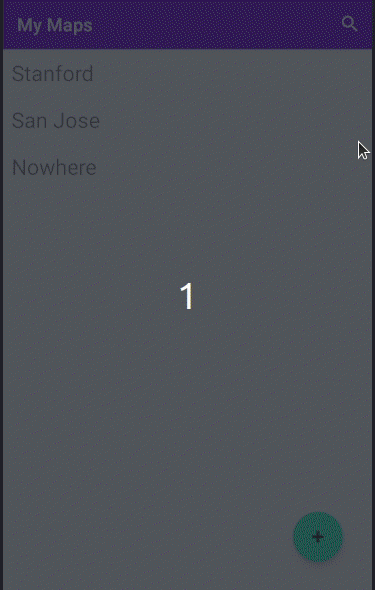

# My Maps 

## *Lisen Deng*

**My Maps** displays a list of maps, each of which show user-defined markers with a title, description, and location. The user can also create a new map. 

Time spent: **6** hours spent in total

## Functionality 

The following **required** functionality is completed:

* [x] The list of map titles is displayed.
* [x] After tapping on a map title, the associated markers in the map are shown.
* [x] The user is able to create a new map.

The following **extensions** are implemented:

* [x] When a map marker is created, the pin is animated.
* [x] Add a falling pin animation when a new map marker is created
* [x] Add the ability to search for maps which contain a string in the title

## Video Walkthrough

Here's a walkthrough of implemented user stories:

GIF created with [Peek](https://github.com/phw/peek).

## Notes
Users need to tap the search view twice to start texting. I tried various fixes online, but none of them worked.

## License

    Copyright [2020] [Lisen Deng]

    Licensed under the Apache License, Version 2.0 (the "License");
    you may not use this file except in compliance with the License.
    You may obtain a copy of the License at

        http://www.apache.org/licenses/LICENSE-2.0

    Unless required by applicable law or agreed to in writing, software
    distributed under the License is distributed on an "AS IS" BASIS,
    WITHOUT WARRANTIES OR CONDITIONS OF ANY KIND, either express or implied.
    See the License for the specific language governing permissions and
    limitations under the License.
